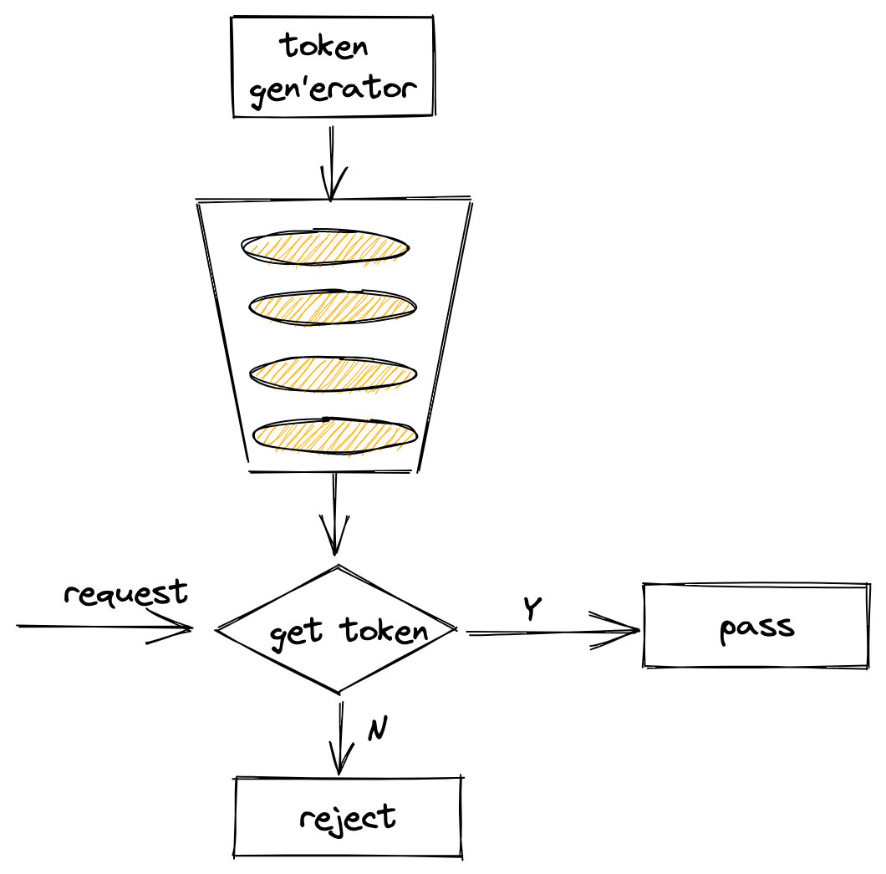

概念
---
什么叫令牌桶算法？它有点像疫情期间你去公园玩，为了保证在公园里的人不超过一定的数量，你得在门口大爷那取号子，拿到号子才能进去玩，没号子你就不能进去。当然这例子有点不是太准确，感兴趣的话可以看下维基百科下的解释：https://en.wikipedia.org/wiki/Token_bucket

下面一幅图简单解释了令牌桶的工作流程：



为了统一，下面均将令牌称之为`token`。

作用
---
限流。是指限制到达系统的并发请求数，当达到限制条件则可以拒绝请求，可以起到保护下游服务，防止服务过载等作用。

使用
---
新建限流器方法：
```go
func NewLimiter(r Limit, b int) *Limiter {
    return &Limiter{
        limit: r, 
		burst: b,
    }
}
```

实例化一个限流器:
```go
package main

limiter := rate.NewLimiter(10, 50)
```
上述初始化的意思是：构造了一个容量为50的的桶，并且以每秒10个`token`的速率往桶里放。

此外，官方还提供了`Every`方法来设置向桶里放`token`的时间间隔：

```go
// 每100ms放一个token，也就是每秒10个
limit := rate.Every(100 * time.Millisecond)
limiter := rate.NewLimiter(limit, 50)
```

Limiter主要用到这几个方法：
- `Wait(ctx context.Context) (err error)`
- `WaitN(ctx context.Context, n int) (err error)`
- `Allow() bool`
- `AllowN(now time.Time, n int) bool`
- `Reserve() *Reservation`
- `ReserveN(now time.Time, n int) *Reservation`

其中，`Wait`/`Allow`/`Reserve`分别是`WaitN(ctx, 1)`/`AllowN(time.Now(), 1)`/`ReserveN(time.Now(), 1)`的简化形式

1. `WaitN`方法代表当桶内的`token`数量小于N时，则等待一段时间（超时时间可以通过`context.withTimeout`设置）。如果`token`数量充足，则从桶中消费掉这N个`token`，则直接返回。

2. `AllowN`方法代表截止到某一时刻，判断桶中的`token`数量至少为N个，如果满足，则从桶中消费掉这N个`token`，返回`true`；否则直接返回`false`。

3. `ReserveN`方法调用完成后，会返回一个`*Reservation`对象，你可以继续使用该对象的`Delay`方法或`Cancel`方法。

实际使用中，可以根据不同的场景使用不同的方法。比如：`AllowN`方法可以用在频繁访问场景中，超过一定的速率则直接拒绝访问。

当然你也可以动态调整限流器的速率和桶大小，使用如下方法：
- `SetLimit(newLimit Limit)`
- `SetBurst(newBurst int)`

源码分析
---

官方限流器并没有通过队列来实现桶的逻辑，下面我们通过源码来看一下。


限流器的定义：
```go
type Limiter struct {
    mu     sync.Mutex
    limit  Limit
    burst  int
    tokens float64
    // last is the last time the limiter's tokens field was updated
    last time.Time
    // lastEvent is the latest time of a rate-limited event (past or future)
    lastEvent time.Time
}
```

这里有几个字段解释一下:
- `limit`：其实就是`float64`的别名。它代表`token`入桶的频率，即每秒可以塞几个`token`到桶里面。
- `burst`:  `token`桶的大小
- `tokens`：桶中剩余的`token`数量
- `last`: 上一次取走`token`的时间
- `lastEvent`: 上一次发生限流时间的时间

`WaitN`、`AllowN`、`ReserveN`这三个方法最终都调用了`reserveN`和`advance`方法，下面我们来看下这两个方法，我已将主要的注释标注上去了。

```go
func (lim *Limiter) advance(now time.Time) (newNow time.Time, newLast time.Time, newTokens float64) {
    // 获得上一次token取走的时间
    last := lim.last
    if now.Before(last) {
        last = now
    }
    // Calculate the new number of tokens, due to time that passed.
    // 计算出上次token和这次token的时间间隔
    elapsed := now.Sub(last)
    // 计算出这段时间可以产生的新token数量(时间*频率)
    delta := lim.limit.tokensFromDuration(elapsed)
    // 计算出当前可以用的tokens数(当前存在的+新产生的)
    tokens := lim.tokens + delta
    // 若当前可用token数大于桶容量burst，则直接将tokens复制为burst
    if burst := float64(lim.burst); tokens > burst {
        tokens = burst
    }
    // 返回请求时间, 上一次token取走的时间，可用的token数
    return now, last, tokens
}
```

可以看到，`advance`方法的作用是: 计算出**当一个请求进来的时刻**，当前可用的`token`数量，并返回请求时间和上一次`token`取走的时间

```go
func (lim *Limiter) reserveN(now time.Time, n int, maxFutureReserve time.Duration) Reservation {
    lim.mu.Lock()
    
    if lim.limit == Inf {
        lim.mu.Unlock()
        return Reservation{
            ok:        true,
            lim:       lim,
            tokens:    n,
            timeToAct: now,
        }
    }
    
    now, last, tokens := lim.advance(now)
    
    // Calculate the remaining number of tokens resulting from the request.
    // 计算出本次请求过后剩余的token数
    tokens -= float64(n)
    
    // Calculate the wait duration
    var waitDuration time.Duration
    // 若token数小于0，代表token数不够，则需要计算等待时间
    if tokens < 0 {
        waitDuration = lim.limit.durationFromTokens(-tokens)
    }
    
    // Decide result
    // 若一次请求的token消耗数小于等于桶容量并且等待时间小于等于最大等待时间，则ok=true
    // 这对应到Allow方法的返回结果
    ok := n <= lim.burst && waitDuration <= maxFutureReserve
    
    // Prepare reservation
    r := Reservation{
        ok:    ok,
        lim:   lim,
        limit: lim.limit,
    }
    if ok {
        r.tokens = n
        r.timeToAct = now.Add(waitDuration)
    }
    
    // Update state
    if ok {
        // 更新请求消耗token后的状态
        lim.last = now
        lim.tokens = tokens
        lim.lastEvent = r.timeToAct
    } else {
        lim.last = last
    }
    
    lim.mu.Unlock()
    return r
}
```
`reserveN`方法的作用是：判断这个请求能否获得想要数量的`token(n)`，并更新这次请求后`Limiter`实例的状态。

从上面的分析可以看到，官方的限流器设计还是很精巧的，结合官方库下的测试用例看得话效果更好。\(^o^)/~


