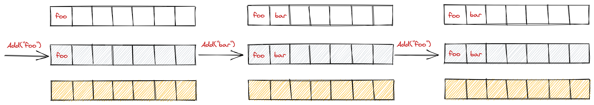
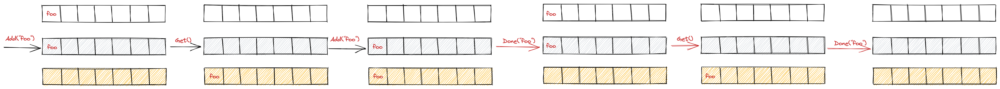

简介
---
今天，我们来看下`client-go`中的`workqueue`包的相关队列的实现。

workqueue包下主要实现了3种队列：
- Type队列
- 延迟队列
- 限速队列

并且和我们常规意义上的队列做了功能的增强：
- 公平有序：按照添加顺序处理元素
- 去重：一个元素在被处理前，若添加多次，最终只会被处理一次
- 并发：多生产者和多消费者
- 通知与指标：有关闭通知机制，且提供`Metric`指标可与`Prometheus`对接

Type队列
---
### Interface接口
`Type`队列实现了`Interface`接口，并且延迟和限速队列(内嵌类型)也实现了这个接口
```go
type Interface interface {
    // 向队列添加元素
    Add(item interface{})
    // 获得队列的长度
    Len() int
    // 获得队列头部(index=0)的一个元素进行处理
    Get() (item interface{}, shutdown bool)
    // 处理完该元素后，需要执行Done方法
    Done(item interface{})
    // 关闭队列
    ShutDown()
    // 等待处理完成并关闭，之后需要调用Done()函数
    ShutDownWithDrain()
    // 判断是否正在关闭
    ShuttingDown() bool
}
```
### Type对象的数据结果
```go
type empty struct{}
type t interface{}
type set map[t]empty

// Type is a work queue (see the package comment).
type Type struct {
    // queue defines the order in which we will work on items. Every
    // element of queue should be in the dirty set and not in the
    // processing set.
    queue []t

    // dirty defines all of the items that need to be processed.
    dirty set

    // Things that are currently being processed are in the processing set.
    // These things may be simultaneously in the dirty set. When we finish
    // processing something and remove it from this set, we'll check if
    // it's in the dirty set, and if so, add it to the queue.
    processing set
    
    cond *sync.Cond
    
    shuttingDown bool
    drain        bool
    
    metrics queueMetrics
    
    unfinishedWorkUpdatePeriod time.Duration
    clock                      clock.WithTicker
}
```
`Type`对象主要有3个存放队列元素的地方，分别是`queue`数组，`dirty map`，`processing map`。

`dirty map`用于存放需要被处理的元素，`processing map`用于存放正在被处理的元素。

一个新元素进入队列，需要调用`Type`对象的`Add()`方法，此时，会将元素同时存放在`queue`数组和`dirty map`中。

执行`Get()`方法后，会将元素从`queue`数组和`dirty map`删除，放入`processing map`。

执行`Done()`方法后，会将元素从`processing map`中删除.

### 简单的几个例子

图可能会更好理解一点
1. 去重。添加相同元素会被舍弃(如果这个元素还没有被处理)

2. 处理时入队，会放入`dirty`中(图片太小可以右键在新标签页中打开)


延迟队列
---

### 接口定义
```go
type DelayingInterface interface {
    Interface
    // AddAfter 在等待一定时间后将元素放到 workqueue 中
    // 若duration <= 0，代表不需要延迟，直接往队列里面添加元素；否则，构造一个waitFor的结构体，塞进初始容量为1000的waitingForAddCh channel中
    AddAfter(item interface{}, duration time.Duration)
}
```

### 消费channel中的数据
既然会往`waitingForAddCh`中生产数据，那必然有消费数据的逻辑。`waitingLoop`是延迟队列的核心。

这里会有一个有序队列`waitForPriorityQueue`，会将元素进行排序，保证进入最终工作队列的元素是排好队的。
```go
// waitingLoop runs until the workqueue is shutdown and keeps a check on the list of items to be added.
func (q *delayingType) waitingLoop() {
    defer utilruntime.HandleCrash()
    
    // Make a placeholder channel to use when there are no items in our list
    never := make(<-chan time.Time)
    
    // Make a timer that expires when the item at the head of the waiting queue is ready
    var nextReadyAtTimer clock.Timer
    
    waitingForQueue := &waitForPriorityQueue{}
    heap.Init(waitingForQueue)
    
    waitingEntryByData := map[t]*waitFor{}
    
    for {
        if q.Interface.ShuttingDown() {
            return
        }
    
        now := q.clock.Now()
    
        // Add ready entries
        for waitingForQueue.Len() > 0 {
            entry := waitingForQueue.Peek().(*waitFor)
            if entry.readyAt.After(now) {
                break
            }
    
            entry = heap.Pop(waitingForQueue).(*waitFor)
            q.Add(entry.data)
            delete(waitingEntryByData, entry.data)
        }
    
        // Set up a wait for the first item's readyAt (if one exists)
        nextReadyAt := never
        if waitingForQueue.Len() > 0 {
            if nextReadyAtTimer != nil {
                nextReadyAtTimer.Stop()
            }
            entry := waitingForQueue.Peek().(*waitFor)
            nextReadyAtTimer = q.clock.NewTimer(entry.readyAt.Sub(now))
            nextReadyAt = nextReadyAtTimer.C()
        }
    
        select {
        case <-q.stopCh:
            return
    
        case <-q.heartbeat.C():
            // continue the loop, which will add ready items
    
        case <-nextReadyAt:
            // continue the loop, which will add ready items
    
        case waitEntry := <-q.waitingForAddCh:
            if waitEntry.readyAt.After(q.clock.Now()) {
                insert(waitingForQueue, waitingEntryByData, waitEntry)
            } else {
                q.Add(waitEntry.data)
            }
    
            drained := false
            for !drained {
                select {
                case waitEntry := <-q.waitingForAddCh:
                    if waitEntry.readyAt.After(q.clock.Now()) {
                        insert(waitingForQueue, waitingEntryByData, waitEntry)
                    } else {
                        q.Add(waitEntry.data)
                    }
                default:
                    drained = true
                }
            }
        }
    }
}
```

限速队列
---

限速队列作用当然是限速。他结合了我们上文提到的各种限速算法。我们先来看下接口定义

### 接口定义
可以看到，它继承了延迟队列

```go
// RateLimitingInterface is an interface that rate limits items being added to the queue.
type RateLimitingInterface interface {
    // 继承延迟队列接口
    DelayingInterface
    
    // AddRateLimited adds an item to the workqueue after the rate limiter says it's ok
    // 按照限速算法的返回时间，延迟添加到队列中
    AddRateLimited(item interface{})
    
    // Forget indicates that an item is finished being retried.  Doesn't matter whether it's for perm failing
    // or for success, we'll stop the rate limiter from tracking it.  This only clears the `rateLimiter`, you
    // still have to call `Done` on the queue.
    Forget(item interface{})
    
    // NumRequeues returns back how many times the item was requeued
    // 元素放入队列的次数
    NumRequeues(item interface{}) int
}
```

### 实现
实现就相对比较简洁了，主要调用的是延迟队列和相关限速算法的接口
```go
// rateLimitingType wraps an Interface and provides rateLimited re-enquing
type rateLimitingType struct {
    // 继承延迟队列
    DelayingInterface
    
    // 限速器
    rateLimiter RateLimiter
}

// AddRateLimited AddAfter's the item based on the time when the rate limiter says it's ok
func (q *rateLimitingType) AddRateLimited(item interface{}) {
    // 按照限速算法的返回时间，延迟添加到队列中
    q.DelayingInterface.AddAfter(item, q.rateLimiter.When(item))
}

func (q *rateLimitingType) NumRequeues(item interface{}) int {
    return q.rateLimiter.NumRequeues(item)
}

func (q *rateLimitingType) Forget(item interface{}) {
    q.rateLimiter.Forget(item)
}
```